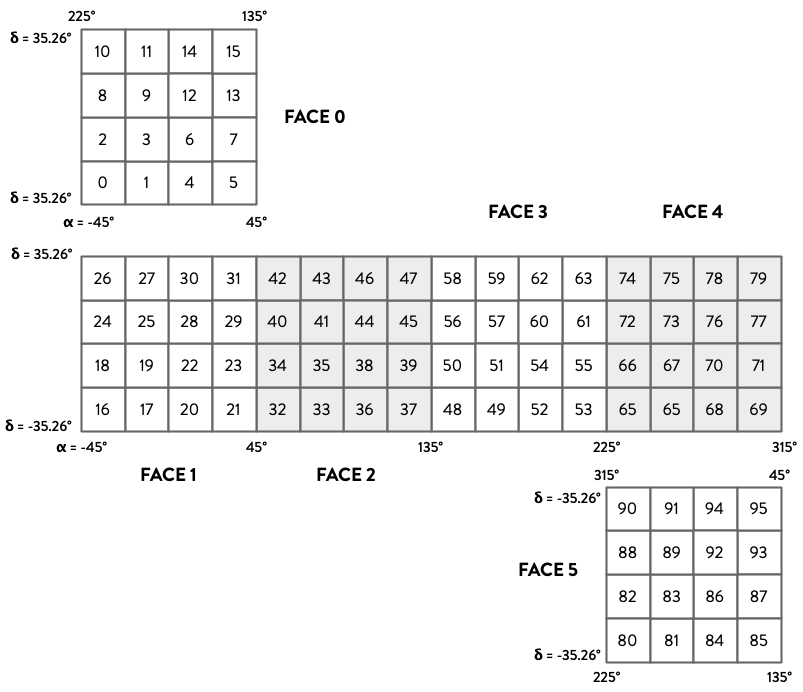

# QLSC: Quadrilateralized Spherical Cube for Python

[](https://qlsc.readthedocs.io/en/latest/?badge=latest)

## Introduction

The quadrilateralized spherical cube (QLSC) is a geospatial indexing scheme for segmenting a sphere into pixels with the aim of optimized spatial indexing and queries. *QLSC* is an implementation of this scheme in a Python package. Parts of it are based on code from Sergey Koposov’s [Q3C](https://github.com/segasai/q3c), a PostgreSQL extension that implements QLSC indexing. In addition to sphere segmentation, this package provides the catalog indexing functionality of Q3C without the need to install a PostgreSQL database.

Note that while this package is designed for astronomical use (it focusses on right ascension and declination), it could be just as easily be used for latitude and longitude coordinates, as long as you’re ok with a perfectly spherical Earth (though QLSC was designed to be used with the real Earth). Future updates may better facilitate this, but contributions are welcome.

Author: Demitri Muna
Copyright © 2020 Demitri Muna, except for the embedded Q3C code which is copyright Sergey Koposov.

## Why Use QLSC?

* You have a large number of points or regions on a sphere that you want to subdivide into approximately equal area divisions.
* You are an astronomer with a catalog that you want to perform cone searches on, but don't want to install a full database to do so.
* You want a spherical projection scheme without all that polar singularity residue.
* You want a scheme that divides a sphere into regions that are easy to conceptualize, draw, and work with, where you can easily control the resolution down to ~0.08 µ".

## Installation

#### Install from [PyPi](https://pypi.org/project/qlsc/)

    pip install qlsc

#### Install from source

    git clone https://github.com/demitri/qlsc.git
    cd qlsc/source
    python setup.py install

## API Documentation

API documentation can be found here: [https://qlsc.readthedocs.io/en/latest/](https://qlsc.readthedocs.io/en/latest/)


## 60 Second Segmentation Introduction

If you’re not familiar with the QLSC scheme it would be better to start below. There are two classes defined in this package, `QLSC` and `QLSCIndex`. The QLSC scheme projects each of the six faces of a cube onto a sphere. Segmentation is performed on the cube faces and performed in levels, where each level divides each bin into four. For example, `depth=2` divides each bin into four, then of those into four again, which is 2^(2*`depth`) (i.e. 16) bins per cube face, or 96 total bins. ("Pixels" and "bin" are used somewhat interchangeably.)

The class can convert between (ra,dec) positions and the pixel number (*ipix*).

```python
from qlsc import QLSC

q = QLSC(depth=2)
q.ang2ipix(45,45)     # ra,dec -> ipix number
q.ipix2ang_center(42) # ipix number -> ra,dec at center of pixel
q.ipix2polygon(42)    # returns the points on the sphere describing
                      # the pixel (joined by great circles)
```

## 60 Second Cone Search Introduction

Performing cone searches is as simple as creating a `QLSCIndex` index object and populating it with coordinates. The highest sphere segmentation resolution is selected by default, but a lower resolution can be chosen. By default, the index is stored in memory, but a file may be chosen so that the index can be reused as a script is rerun or by multiple scripts. Points are added in α,δ coordinates in degrees. Once points are added to the index you can perform a cone search.

The example below uses an included function to generate any number of points evenly distributed on a sphere (useful for testing).

```python
from qlsc import QLSCIndex
from qlsc.generate import sunflower_points_on_sphere

index = QLSCIndex() # created in memory, defaults to highest resolution

# add ra,dec points from a NumPy array (shape (n,2))
points = sunflower_points_on_sphere(n=1e5)
index.add_points(points=points)

# or individually
index.add_point(12., 34.)

# keys can also be attached to points
index.add_point(56.59625, 78.00866, key="a catalog ID")

# cone search at center α=56, δ=-40
matches = index.radial_query(ra=56., dec=-40., radius=0.5) # float deg or astropy.units.Quantity
```

Further examples are provided in the directory "examples" that show how the scheme and indexing can be used.

## The Quadrilateralized Spherical Cube

The quadrilateralized spherical cube was first devised in 1975 in a technical report by F.K. Chan and E.M. O'Neill ([available here](https://ntrl.ntis.gov/NTRL/dashboard/searchResults/titleDetail/ADA010232.xhtml)). It begins with a cube inscribed within a sphere:


The six cube faces are then projected onto the sphere via transforms defined in the paper. This is the lowest resolution. Higher resolutions are achieved in steps: each step divides the bin, or pixel, into four. The first step will have four bins per face, the next will have 16, etc. The code refers to the level of subdivision as "depth" (number of times the bin has been subdivided), where the diagram above is `depth=0`. The Q3C PostgreSQL extension uses a depth of 30, which is 1,152,921,504,606,846,976 bins per cube face (six times that over the full sphere) corresponding to ~0.08 μ" square per pixel. The QLSC package supports any depth from 0 to 30.

| Cube Face Number | RA Range | Face Center    |
|:----------------:| :------: | :------------: |
|  0          | top face | α = 0°, δ = 90° |
|  1          | -45° ≤ δ ≤ 45° | α = 0°, δ = 0° |
|  2          | 45° ≤ δ ≤ 135° | α = 90°, δ = 0° |
|  3          | 135° ≤ δ ≤ 225° | α = 180°, δ = 0° |
|  4          | 225° ≤ δ ≤ 315° | α = 270°, δ = 0° |
|  5          | bottom face | α = 0°, δ = -90° |

The diagram below shows the pixel numbering scheme over the entire sphere for `depth=2`. Note the path of the numbering scheme: this is called *[z-order](https://en.wikipedia.org/wiki/Z-order_curve)* which has the benefit that ipix numbers that are close to one another are also close spatially.



The diagram below shows face 1 divided at `depth=2` and the projection of each pixel onto the sphere. Other faces have been hidden for clarity.


The scheme is advantageous in that there are no discontinuities at the poles, and the indexing scheme is optimized for fast database queries. While not all pixels cover the same area, they are equal to within a few percent.


For most users, working in ipix values and ra,dec coordinates will accomplish most anything needed. For those who might be performing more complex calculations, I recommend working in the native coordinates of the face plane. Each face (at any division level) has its 2D coordinate system origin at the cube face center. Both the *x* and *y* axes range from -1 to +1. Methods are provided to translate between *xy* coordinates, ipix value, and ra/dec coordinates. The source code for the [`ipix2polygon()`](https://qlsc.readthedocs.io/en/latest/api.html#qlsc.QLSC.ipix2polygon) method provides an illustrative example.

## References & Links

* [Original Chan, O'Neill 1975 paper](https://ntrl.ntis.gov/NTRL/dashboard/searchResults/titleDetail/ADA010232.xhtml)
* [Abridged F.K. Chan paper - A Quadrilateralized Spherical Cube Earth Data Base](https://ntrs.nasa.gov/archive/nasa/casi.ntrs.nasa.gov/19810002572.pdf)
* [Koposov, Bartunov Q3C ADASS proceedings paper](https://ui.adsabs.harvard.edu/abs/2006ASPC..351..735K/abstract)
* [Stack Overflow - Is the quadrilateralized spherical cube map projection the same as Snyder's cubic equal area map projection?](https://gis.stackexchange.com/questions/40957/is-the-quadrilateralized-spherical-cube-map-projection-the-same-as-snyders-cubi) (with comments from Ken Chan)
* [Wikipedia - Quadrilateralized spherical cube](https://en.wikipedia.org/wiki/Quadrilateralized_spherical_cube)
* [COBE Quadrilateralized Spherical Cube](https://lambda.gsfc.nasa.gov/product/cobe/skymap_info_new.cfm)

## Appendix

For quick reference, the following table lists the parameters of the QLSC scheme for every available depth.

| Depth | No. Bins per Cube Face | No. Bins on Sphere | Bin Area (sr) | Bin Area (square µas) | Bin Area (square deg) |
| ----- | -----------------------| ------------------ | --------------- | --------- | -------------- |
|0	| 1	| 6	| 2.094395E+00	| 8.910640E+16	| 6.875494E+03|
|1	| 4	| 24	| 5.235988E-01	| 2.227660E+16	| 1.718873E+03|
|2	| 16	| 96	| 1.308997E-01	| 5.569150E+15	| 4.297183E+02|
|3	| 64	| 384	| 3.272492E-02	| 1.392287E+15	| 1.074296E+02|
|4	| 256	| 1,536	| 8.181231E-03	| 3.480719E+14	| 2.685740E+01|
|5	| 1,024	| 6,144	| 2.045308E-03	| 8.701797E+13	| 6.714349E+00|
|6	| 4,096	| 24,576	| 5.113269E-04	| 2.175449E+13	| 1.678587E+00|
|7	| 16,384	| 98,304	| 1.278317E-04	| 5.438623E+12	| 4.196468E-01|
|8	| 65,536	| 393,216	| 3.195793E-05	| 1.359656E+12	| 1.049117E-01|
|9	| 262,144	| 1,572,864	| 7.989483E-06	| 3.399139E+11	| 2.622793E-02|
|10	| 1,048,576	| 6,291,456	| 1.997371E-06	| 8.497848E+10	| 6.556982E-03|
|11	| 4,194,304	| 25,165,824	| 4.993427E-07	| 2.124462E+10	| 1.639245E-03|
|12	| 16,777,216	| 100,663,296	| 1.248357E-07	| 5.311155E+09	| 4.098114E-04|
|13	| 67,108,864	| 402,653,184	| 3.120892E-08	| 1.327789E+09	| 1.024528E-04|
|14	| 268,435,456	| 1,610,612,736	| 7.802230E-09	| 3.319472E+08	| 2.561321E-05|
|15	| 1,073,741,824	| 6,442,450,944	| 1.950557E-09	| 8.298680E+07	| 6.403302E-06|
|16	| 4,294,967,296	| 25,769,803,776	| 4.876394E-10	| 2.074670E+07	| 1.600826E-06|
|17	| 17,179,869,184	| 103,079,215,104	| 1.219098E-10	| 5.186675E+06	| 4.002064E-07|
|18	| 68,719,476,736	| 412,316,860,416	| 3.047746E-11	| 1.296669E+06	| 1.000516E-07|
|19	| 274,877,906,944	| 1,649,267,441,664	| 7.619365E-12	| 3.241672E+05	| 2.501290E-08|
|20	| 1,099,511,627,776	| 6,597,069,766,656	| 1.904841E-12	| 8.104180E+04	| 6.253225E-09|
|21	| 4,398,046,511,104	| 26,388,279,066,624	| 4.762103E-13	| 2.026045E+04	| 1.563306E-09|
|22	| 17,592,186,044,416	| 105,553,116,266,496	| 1.190526E-13	| 5.065112E+03	| 3.908266E-10|
|23	| 70,368,744,177,664	| 422,212,465,065,984	| 2.976314E-14	| 1.266278E+03	| 9.770664E-11|
|24	| 281,474,976,710,656	| 1,688,849,860,263,940	| 7.440786E-15	| 3.165695E+02	| 2.442666E-11|
|25	| 1,125,899,906,842,620	| 6,755,399,441,055,720	| 1.860197E-15	| 7.914238E+01	| 6.106665E-12|
|26	| 4,503,599,627,370,500	| 27,021,597,764,223,000	| 4.650491E-16	| 1.978559E+01	| 1.526666E-12|
|27	| 18,014,398,509,482,000	| 108,086,391,056,892,000	| 1.162623E-16	| 4.946399E+00	| 3.816666E-13|
|28	| 72,057,594,037,927,900	| 432,345,564,227,567,000	| 2.906557E-17	| 1.236600E+00	| 9.541664E-14|
|29	| 288,230,376,151,712,000	| 1,729,382,256,910,270,000	| 7.266393E-18	| 3.091499E-01	| 2.385416E-14|
|30	| 1,152,921,504,606,850,000	| 6,917,529,027,641,100,000	| 1.816598E-18	| 7.728748E-02	| 5.963540E-15|
