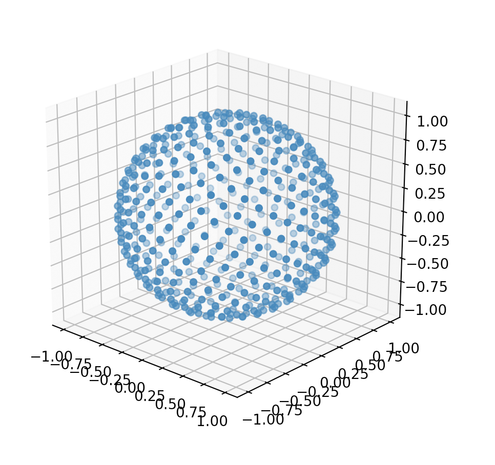

Generating Sample Points
========================

Generating sample datasets is useful for testing and visualization.
For example, it's easier to deterministically generate one million points
on a sphere than include a file containing those points.
Included with QLSC is a function called :py:func:`sunflower_points_on_sphere<qlsc.generate.sunflower_points_on_sphere>` which generates
the specified number of points roughly evenly distributed on a sphere. (The code is taken
from this `Stack Overflow answer <https://stackoverflow.com/a/44164075/2712652>`_.)

The format of the points can be returned as appropriate for their use case. For example,
it's convenient to return the values in radians for plotting. This is a simple example that
generates 1000 points and plots them:

.. code-block:: 

	import numpy as np
	from math import pi
	import matplotlib.pyplot as plt
	from mpl_toolkits.mplot3d import Axes3D

	from qlsc.generate import sunflower_points_on_sphere

	# generate points for plotting
	points = sunflower_points_on_sphere(n=500, radians=True)
	# convert points to (x,y,z) to plot
	phi   = points[:,1] # math convention
	theta = points[:,0]
	x = np.sin(theta) * np.cos(phi)
	y = np.cos(theta) * np.cos(phi)
	z = np.sin(phi)
	plt.figure().add_subplot(111, projection='3d').scatter(x, y, z);
	plt.show()

which produces:

